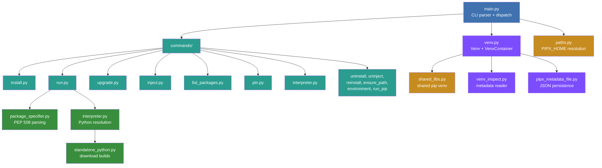

---
hide:
  - navigation
---

Thanks for your interest in contributing to pipx!

Everyone who interacts with the pipx project via codebase, issue tracker, chat rooms, or otherwise is expected to follow
the [PSF Code of Conduct](https://github.com/pypa/.github/blob/main/CODE_OF_CONDUCT.md).

## Submitting changes

1. Fork [the GitHub repository](https://github.com/pypa/pipx).
1. Make a branch off of `main` and commit your changes to it.
1. Add a changelog entry.
1. Submit a pull request to the `main` branch on GitHub, referencing an open issue.

### Changelog entries

The `CHANGELOG.md` file is built by [towncrier](https://pypi.org/project/towncrier/) from news fragments in the
`changelog.d/` directory. To add an entry, create a news fragment in that directory named `{number}.{type}.md`, where
`{number}` is the issue number, and `{type}` is one of `feature`, `bugfix`, `doc`, `removal`, or `misc`.

For example, if your issue number is 1234 and it's fixing a bug, then you would create `changelog.d/1234.bugfix.md`. PRs
can span multiple categories by creating multiple files: if you added a feature and deprecated/removed an old feature
for issue #5678, you would create `changelog.d/5678.feature.md` and `changelog.d/5678.removal.md`.

A changelog entry is meant for end users and should only contain details relevant to them. In order to maintain a
consistent style, please keep the entry to the point, in sentence case, shorter than 80 characters, and in an imperative
tone. An entry should complete the sentence "This change will ...". If one line is not enough, use a summary line in an
imperative tone, followed by a description of the change in one or more paragraphs, each wrapped at 80 characters and
separated by blank lines.

You don't need to reference the pull request or issue number in a changelog entry, since towncrier will add a link using
the number in the file name. Similarly, you don't need to add your name to the entry, since that will be associated with
the pull request.

## Codebase Architecture

All source code lives under `src/pipx/`. The CLI entry point is `main.py`, which dispatches to command modules in
`commands/`.



### Key modules

`venv.py` is the core abstraction. `Venv` wraps a single virtual environment (create, install, uninstall, upgrade) and
`VenvContainer` manages the collection under `PIPX_HOME/venvs/`. Both delegate pip operations to the shared libraries
venv managed by `shared_libs.py`.

`paths.py` resolves all directory locations from environment variables, platform defaults, and legacy fallback paths.
`pipx_metadata_file.py` serializes install options (spec, pip args, injected packages) to JSON inside each venv so that
`upgrade` and `reinstall` can reproduce the original install.

`interpreter.py` and `standalone_python.py` handle Python version resolution. When `--fetch-missing-python` is passed,
pipx downloads a standalone build from
[python-build-standalone](https://github.com/astral-sh/python-build-standalone/releases) and caches it locally. The
`pipx interpreter` subcommands (list, prune, upgrade) manage these cached interpreters.

`commands/run.py` includes PEP 723 inline script metadata parsing. When you run a `.py` file, pipx scans for a
`# /// script` block, extracts TOML-declared dependencies, and installs them into a cached temporary venv.

## Running pipx For Development

To develop `pipx`, either create a [developer environment](#creating-a-developer-environment), or perform an editable
install:

```
python -m pip install -e .
python -m pipx --version
```

## Running Tests

### Setup

pipx uses [tox](https://pypi.org/project/tox/) for development, continuous integration testing, and various tasks.

`tox` defines environments in `tox.toml` which can be run with `tox run -e ENV_NAME`. Environment names can be listed
with `tox list`.

Install tox for pipx development:

```
python -m pip install --user tox
```

Tests are defined as `tox` environments. You can see all tox environments with

```
tox list
```

At the time of this writing, the output looks like this

```
default environments:
3.13     -> run tests with 3.13
3.12     -> run tests with 3.12
3.11     -> run tests with 3.11
3.10     -> run tests with 3.10
lint     -> run pre-commit on the codebase
docs     -> build documentation
man      -> build man page
```

### Creating a developer environment

For developing the tool (and to attach to your IDE) we recommend creating a Python environment via `tox run -e dev`,
afterwards use the Python interpreter available under `.tox/dev/bin/python`.

### Unit Tests

To run unit tests in Python 3.12, you can run

```
tox run -e 3.12
```

> [!TIP]
> You can run a specific unit test by passing arguments to pytest, the test runner pipx uses:
>
> ```
> tox run -e 3.10 -- -k EXPRESSION
> ```
>
> `EXPRESSION` can be a test name, such as
>
> ```
> tox run -e 3.10 -- -k test_uninstall
> ```
>
> Coverage errors can usually be ignored when only running a subset of tests.

### Running Unit Tests Offline

Running the unit tests requires a directory `.pipx_tests/package_cache` to be populated from a fixed list of package
distribution files (wheels or source files). If you have network access, `tox` automatically makes sure this directory
is populated (including downloading files if necessary) as a first step. Thus, if you are running the tests with network
access, you can ignore the rest of this section.

If, however, you wish to run tests offline without the need for network access, you can populate
`.pipx_tests/package_cache` yourself manually beforehand when you do have network access.

### Lint Tests

Linting is done via `pre-commit`, setting it up and running it can be done via `tox` by typing:

```
tox run -e lint
```

### Installing or injecting new packages in tests

If the tests are modified such that a new package / version combination is `pipx install`ed or `pipx inject`ed that
wasn't used in other tests, then one must make sure it's added properly to the packages lists in
`testdata/tests_packages`.

To accomplish this:

- Edit `testdata/tests_packages/primary_packages.txt` to add the new package(s) that you wish to `pipx install` or
    `pipx inject` in the tests.

Then using Github workflows to generate all platforms in the Github CI:

- Manually activate the Github workflow: Create tests package lists for offline tests
- Download the artifact `lists` and put the files from it into `testdata/tests_packages/`

Finally, check-in the new or modified list files in the directory `testdata/tests_packages`

## Testing pipx on Continuous Integration builds

Upon opening pull requests GitHub Actions will automatically trigger.

## Building Documentation

`pipx` autogenerates API documentation, and also uses templates.

When updating pipx docs, make sure you are modifying the `docs` directory.

You can generate the documentation with

```
tox run -e docs
```

This will capture CLI documentation for any pipx argument modifications, as well as generate templates to the docs
directory.

## Releasing New `pipx` Versions

The release process for pipx is designed to be simple and fully automated with a single button press. The workflow
automatically determines the next version based on changelog fragments, generates the changelog, creates the release
commit, and publishes to PyPI.

### Initiating a Release

Navigate to the **Actions** tab in the GitHub repository and select the **Pre-release** workflow. Click **Run workflow**
and choose the appropriate version bump strategy. The `auto` option intelligently determines whether a minor or patch
bump is needed by examining the types of changelog fragments present. If new features or removals exist, it performs a
minor version bump; otherwise, it increments the patch version. Alternatively, you can explicitly select `major`,
`minor`, or `patch` to control the version increment directly.

### What Happens During Release

Once triggered, the pre-release workflow executes the `scripts/release.py` script which collects all changelog fragments
from the `changelog.d/` directory and uses towncrier to generate the updated changelog. It then creates a release commit
with the message "Release {version}" and tags it with the version number. After running pre-commit hooks to ensure
formatting, both the commit and tag are pushed to the main branch.

The act of pushing a version tag (matching the pattern `*.*.*`) automatically triggers the main release workflow. This
workflow builds the project distribution files, publishes the package to PyPI using trusted publishing, creates a GitHub
release with auto-generated notes, and builds the zipapp using the minimum supported Python version before uploading it
to the GitHub release assets.

### Version Calculation Examples

Starting from version `1.8.0`, the version bump types produce the following results: `auto` with feature fragments
becomes `1.9.0`, while `auto` with only bugfixes becomes `1.8.1`. Selecting `major` explicitly jumps to `2.0.0`, `minor`
moves to `1.9.0`, and `patch` increments to `1.8.1`. This automation eliminates the need for manual version management
and ensures consistency across releases.
