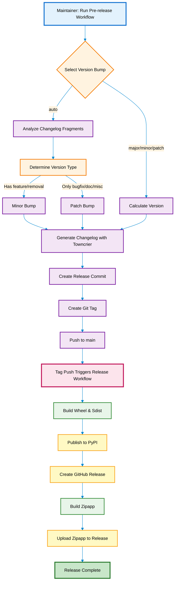

Thanks for your interest in contributing to pipx!

Everyone who interacts with the pipx project via codebase, issue tracker, chat rooms, or otherwise is expected to follow
the [PSF Code of Conduct](https://github.com/pypa/.github/blob/main/CODE_OF_CONDUCT.md).


## Submitting changes

1. Fork [the GitHub repository](https://github.com/pypa/pipx).
2. Make a branch off of `main` and commit your changes to it.
3. Add a changelog entry.
4. Submit a pull request to the `main` branch on GitHub, referencing an
   open issue.

### Changelog entries

The `CHANGELOG.md` file is built by
[towncrier](https://pypi.org/project/towncrier/) from news fragments in the
`changelog.d/` directory. To add an entry, create a news fragment in that directory
named `{number}.{type}.md`, where `{number}` is the issue number,
and `{type}` is one of `feature`, `bugfix`, `doc`, `removal`, or `misc`.

For example, if your issue number is 1234 and it's fixing a bug, then you
would create `changelog.d/1234.bugfix.md`. PRs can span multiple
categories by creating multiple files: if you added a feature and
deprecated/removed an old feature for issue #5678, you would create
`changelog.d/5678.feature.md` and `changelog.d/5678.removal.md`.

A changelog entry is meant for end users and should only contain details
relevant to them. In order to maintain a consistent style, please keep
the entry to the point, in sentence case, shorter than 80 characters,
and in an imperative tone. An entry should complete the sentence "This
change will ...". If one line is not enough, use a summary line in an
imperative tone, followed by a description of the change in one or more
paragraphs, each wrapped at 80 characters and separated by blank lines.

You don't need to reference the pull request or issue number in a
changelog entry, since towncrier will add a link using the number in the
file name. Similarly, you don't need to add your name to the entry,
since that will be associated with the pull request.

## Running pipx For Development

To develop `pipx`, either create a [developer environment](#creating-a-developer-environment), or perform an editable
install:

```
python -m pip install -e .
python -m pipx --version
```

## Running Tests

### Setup

pipx uses an automation tool called [nox](https://pypi.org/project/nox/) for development, continuous integration
testing, and various tasks.

`nox` defines tasks or "sessions" in `noxfile.py` which can be run with `nox -s SESSION_NAME`. Session names can be
listed with `nox -l`.

Install nox for pipx development:

```
python -m pip install --user nox
```

Tests are defined as `nox` sessions. You can see all nox sessions with

```
nox -l
```

At the time of this writing, the output looks like this

```
- refresh_packages_cache-3.12 -> Populate .pipx_tests/package_cache
- refresh_packages_cache-3.11 -> Populate .pipx_tests/package_cache
- refresh_packages_cache-3.10 -> Populate .pipx_tests/package_cache
- refresh_packages_cache-3.9 -> Populate .pipx_tests/package_cache
- refresh_packages_cache-3.8 -> Populate .pipx_tests/package_cache
- tests_internet-3.12 -> Tests using internet pypi only
- tests_internet-3.11 -> Tests using internet pypi only
- tests_internet-3.10 -> Tests using internet pypi only
- tests_internet-3.9 -> Tests using internet pypi only
- tests_internet-3.8 -> Tests using internet pypi only
* tests-3.12 -> Tests using local pypiserver only
* tests-3.11 -> Tests using local pypiserver only
* tests-3.10 -> Tests using local pypiserver only
* tests-3.9 -> Tests using local pypiserver only
* tests-3.8 -> Tests using local pypiserver only
- test_all_packages-3.12
- test_all_packages-3.11
- test_all_packages-3.10
- test_all_packages-3.9
- test_all_packages-3.8
- cover -> Coverage analysis
* lint
- develop-3.12
- develop-3.11
- develop-3.10
- develop-3.9
- develop-3.8
- build
- publish
* build_docs
- watch_docs
* build_man
- create_test_package_list-3.12
- create_test_package_list-3.11
- create_test_package_list-3.10
- create_test_package_list-3.9
- create_test_package_list-3.8
```

### Creating a developer environment

For developing the tool (and to attach to your IDE) we recommend creating a Python environment via
`nox -s develop-3.12`, afterwards use the Python interpreter available under `.nox/develop-3.12/bin/python`.

### Unit Tests

To run unit tests in Python3.12, you can run

```
nox -s tests-3.12
```

> [!TIP]
>
> You can run a specific unit test by passing arguments to pytest, the test runner pipx uses:
>
> ```
> nox -s tests-3.9 -- -k EXPRESSION
> ```
>
> `EXPRESSION` can be a test name, such as
>
> ```
> nox -s tests-3.9 -- -k test_uninstall
> ```
>
> Coverage errors can usually be ignored when only running a subset of tests.

### Running Unit Tests Offline

Running the unit tests requires a directory `.pipx_tests/package_cache` to be populated from a fixed list of package
distribution files (wheels or source files). If you have network access, `nox -s tests` automatically makes sure this
directory is populated (including downloading files if necessary) as a first step. Thus, if you are running the tests
with network access, you can ignore the rest of this section.

If, however, you wish to run tests offline without the need for network access, you can populate
`.pipx_tests/package_cache` yourself manually beforehand when you do have network access.

### Populating the cache directory using nox

To populate `.pipx_tests/package_cache` manually using nox, execute:

```
nox -s refresh_packages_cache
```

This will sequence through available python executable versions to populate the cache directory for each version of
python on your platform.

### Lint Tests

Linting is done via `pre-commit`, setting it up and running it can be done via `nox` by typing:

```
nox -s lint
```

### Installing or injecting new packages in tests

If the tests are modified such that a new package / version combination is `pipx install`ed or `pipx inject`ed that
wasn't used in other tests, then one must make sure it's added properly to the packages lists in
`testdata/tests_packages`.

To accomplish this:

- Edit `testdata/tests_packages/primary_packages.txt` to add the new package(s) that you wish to `pipx install` or
  `pipx inject` in the tests.

Then using Github workflows to generate all platforms in the Github CI:

- Manually activate the Github workflow: Create tests package lists for offline tests
- Download the artifact `lists` and put the files from it into `testdata/tests_packages/`

Or to locally generate these lists from `testdata/tests_packages/primary_packages.txt`, on the target platform execute:

- `nox -s create_test_package_list`

Finally, check-in the new or modified list files in the directory `testdata/tests_packages`

## Testing pipx on Continuous Integration builds

Upon opening pull requests GitHub Actions will automatically trigger.

## Building Documentation

`pipx` autogenerates API documentation, and also uses templates.

When updating pipx docs, make sure you are modifying the `docs` directory.

You can generate the documentation with

```
nox -s build_docs
```

This will capture CLI documentation for any pipx argument modifications, as well as generate templates to the docs
directory.

To preview changes, including live reloading, open another terminal and run

```
nox -s watch_docs
```

## Releasing New `pipx` Versions

The release process for pipx is designed to be simple and fully automated with a single button press. The workflow automatically determines the next version based on changelog fragments, generates the changelog, creates the release commit, and publishes to PyPI.

### Release Process Overview



### Initiating a Release

Navigate to the **Actions** tab in the GitHub repository and select the **Pre-release** workflow. Click **Run workflow** and choose the appropriate version bump strategy. The `auto` option intelligently determines whether a minor or patch bump is needed by examining the types of changelog fragments present. If new features or removals exist, it performs a minor version bump; otherwise, it increments the patch version. Alternatively, you can explicitly select `major`, `minor`, or `patch` to control the version increment directly.

### What Happens During Release

Once triggered, the pre-release workflow executes the `scripts/release.py` script which collects all changelog fragments from the `changelog.d/` directory and uses towncrier to generate the updated changelog. It then creates a release commit with the message "Release {version}" and tags it with the version number. After running pre-commit hooks to ensure formatting, both the commit and tag are pushed to the main branch.

The act of pushing a version tag (matching the pattern `*.*.*`) automatically triggers the main release workflow. This workflow builds the project distribution files, publishes the package to PyPI using trusted publishing, creates a GitHub release with auto-generated notes, and builds the zipapp using the minimum supported Python version before uploading it to the GitHub release assets.

### Version Calculation Examples

Starting from version `1.8.0`, the version bump types produce the following results: `auto` with feature fragments becomes `1.9.0`, while `auto` with only bugfixes becomes `1.8.1`. Selecting `major` explicitly jumps to `2.0.0`, `minor` moves to `1.9.0`, and `patch` increments to `1.8.1`. This automation eliminates the need for manual version management and ensures consistency across releases.
