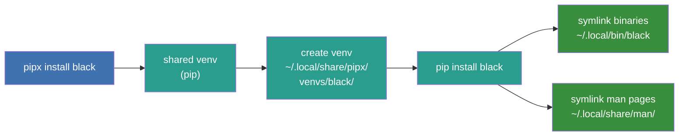
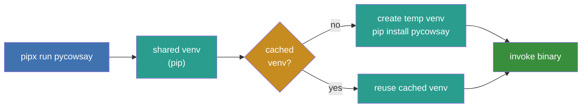
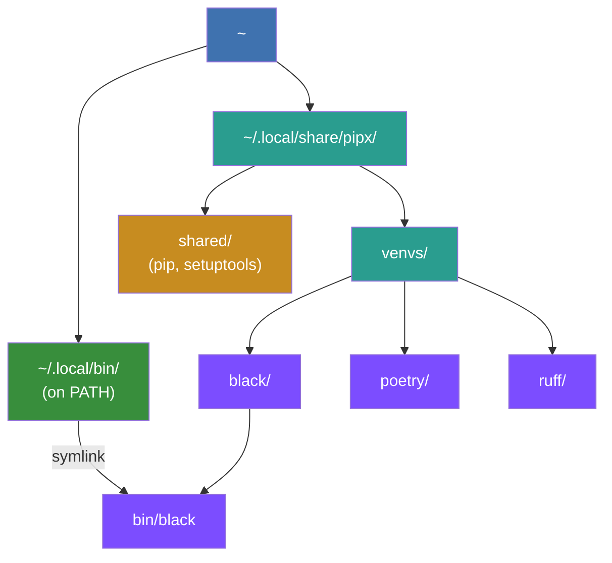

## How it Works

### `pipx install`

When installing a package and its binaries on Linux (`pipx install package`), pipx first creates or reuses a shared
virtual environment at `~/.local/share/pipx/shared/` that contains the packaging library `pip`, ensuring it is updated
to its latest version. It then creates an isolated virtual environment at `~/.local/share/pipx/venvs/PACKAGE` that uses
the shared pip via a [.pth file](https://docs.python.org/3/library/site.html) and installs the desired package into it.

Once the package is installed, pipx exposes its console scripts and GUI scripts by symlinking them into `~/.local/bin`
(for example, `~/.local/bin/black` -> `~/.local/share/pipx/venvs/black/bin/black`). It also symlinks any manual pages
into
`~/.local/share/man/man[1-9]`. As long as `~/.local/bin/` is on your `PATH`, the new commands are available globally,
and on systems with `man` support the pages are accessible too.

Adding the `--global` flag to any `pipx` command executes the action in global scope, exposing the app to all system
users. See the [configuration reference](../how-to/configure-paths.md#-global-argument) for details. Note that this is
not available on Windows.

### `pipx run`

`pipx run BINARY` reuses the same shared pip environment, then either reuses a cached virtual environment or creates a
new temporary one. The cache key is a hash of the package name, spec, python version, and pip arguments. pipx creates a
virtual environment with `python -m venv`, installs the package, and invokes the binary.

Cached environments expire after a few days. On next run, pipx fetches the latest version.

### Directory layout

The overall directory structure that pipx manages looks like this:

You can do all of this yourself. pipx automates it. Pass `--verbose` to see every command and argument pipx runs.
