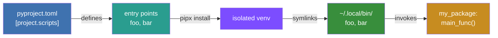

## Developing for pipx

If you are a developer and want to be able to run

```
pipx install MY_PACKAGE
```

make sure you include `scripts` in your main table[^1] in `pyproject.toml` or its legacy equivalents for `setup.cfg` and
`setup.py`. pipx also exposes `gui-scripts` entry points, which are useful for GUI applications on Windows (they launch
without opening a console window).

=== "pyproject.toml"

    ```ini
    [project.scripts]
    foo = "my_package.some_module:main_func"
    bar = "other_module:some_func"

    [project.gui-scripts]
    baz = "my_package_gui:start_func"
    ```

=== "setup.cfg"

    ```ini
    [options.entry_points]
    console_scripts =
        foo = my_package.some_module:main_func
        bar = other_module:some_func
    gui_scripts =
        baz = my_package_gui:start_func
    ```

=== "setup.py"

    ```python
    setup(
        # other arguments here...
        entry_points={
            'console_scripts': [
                'foo = my_package.some_module:main_func',
                'bar = other_module:some_func',
            ],
            'gui_scripts': [
                'baz = my_package_gui:start_func',
            ]
        },
    )
    ```

In this case `foo` and `bar` (and `baz` on Windows) would be available as "applications" to pipx after installing the
above example package, invoking their corresponding entry point functions.



### Manual pages

If you wish to provide documentation via `man` pages on UNIX-like systems then these can be added as data files:

=== "setuptools"

    ```toml title="pyproject.toml"
    [tool.setuptools.data-files]
    "share/man/man1" = [
      "manpage.1",
    ]
    ```

    ```ini title="setup.cfg"
    [options.data_files]
    share/man/man1 =
        manpage.1
    ```

    ```python title="setup.py"
    setup(
        # other arguments here...
        data_files=[('share/man/man1', ['manpage.1'])]
    )
    ```

    > [!WARNING]
    > The `data-files` keyword is "discouraged" in the
    > [setuptools documentation](https://setuptools.pypa.io/en/latest/userguide/pyproject_config.html#setuptools-specific-configuration)
    > but there is no alternative if `man` pages are a requirement.

=== "pdm-backend"

    ```toml title="pyproject.toml"
    [tool.pdm.build]
    source-includes = ["share"]

    [tool.pdm.build.wheel-data]
    data = [
      { path = "share/man/man1/*", relative-to = "." },
    ]
    ```

In this case the manual page `manpage.1` could be accessed by the user after installing the above example package.

For a real-world example, see [pycowsay](https://github.com/cs01/pycowsay/blob/master/setup.py)'s `setup.py` source
code.

You can read more about entry points
[here](https://setuptools.pypa.io/en/latest/userguide/quickstart.html#entry-points-and-automatic-script-creation).

[^1]: This is often the `[project]` table, but might also be differently named. Read more in the
    [PyPUG](https://packaging.python.org/en/latest/guides/writing-pyproject-toml/#writing-your-pyproject-toml).
