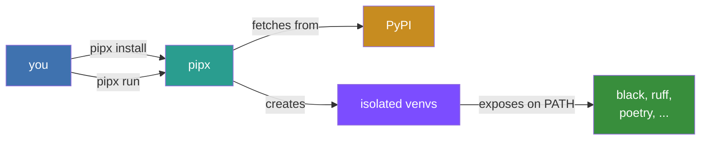

# pipx — Install and Run Python Applications in Isolated Environments

pipx installs and runs end-user Python applications in isolated environments. It fills the same role as macOS's `brew`,
JavaScript's [npx](https://medium.com/@maybekatz/introducing-npx-an-npm-package-runner-55f7d4bd282b), and Linux's `apt`.
Under the hood it uses pip, but unlike pip it creates a separate virtual environment for each application, keeping your
system clean.

## Documentation

- **[Tutorials](tutorial/index.md)** — install your first application and run commands in temporary environments.
- **[How-to Guides](how-to/index.md)** — recipes for installing pipx, injecting packages, configuring paths, and more.
- **[Reference](reference/index.md)** — CLI flags, examples, environment variables, and programs to try.
- **[Explanation](explanation/index.md)** — how pipx works under the hood and how it compares to other tools.

## pip vs pipx

pip installs both libraries and applications into your current environment with no isolation. pipx installs only
applications, each in its own virtual environment, and exposes their commands on your `PATH`. You get clean uninstalls
and zero dependency conflicts between tools.

## Where do apps come from?

pipx pulls packages from [PyPI](https://pypi.org/) by default, but accepts any source pip supports: local directories,
wheels, and git URLs. Any package that declares
[console script entry points](https://python-packaging.readthedocs.io/en/latest/command-line-scripts.html#the-console-scripts-entry-point)
works with pipx. [Poetry](https://python-poetry.org/docs/pyproject/#scripts) and
[hatch](https://hatch.pypa.io/latest/config/metadata/#cli) users can add entry points the same way.

## Features

pipx lets you

- install CLI apps into isolated environments with `pipx install`, guaranteeing no dependency conflicts and clean
    uninstalls;
- list, upgrade, and uninstall packages in one command; and
- run the latest version of any app in a temporary environment with `pipx run`.

pipx runs with regular user permissions and never calls `sudo pip install`.

## Testimonials

> "Thanks for improving the workflow that pipsi has covered in the past. Nicely done!"
>
> — *[Jannis Leidel](https://twitter.com/jezdez), PSF fellow, former pip and Django core developer, and founder of the
> Python Packaging Authority (PyPA)*

> "My setup pieces together pyenv, poetry, and pipx. [...] For the things I need, it's perfect."
>
> — *[Jacob Kaplan-Moss](https://twitter.com/jacobian), co-creator of Django in blog post
> [My Python Development Environment, 2020 Edition](https://jacobian.org/2019/nov/11/python-environment-2020/)*

> "I'm a big fan of pipx. I think pipx is super cool."
>
> — *[Michael Kennedy](https://twitter.com/mkennedy), co-host of PythonBytes podcast in
> [episode 139](https://pythonbytes.fm/episodes/transcript/139/f-yes-for-the-f-strings)*

## Credits

pipx was inspired by [pipsi](https://github.com/mitsuhiko/pipsi) and [npx](https://github.com/npm/npx). It was created
by [Chad Smith](https://github.com/cs01/) and has had lots of help from
[contributors](https://github.com/pypa/pipx/graphs/contributors). The logo was created by
[@IrishMorales](https://github.com/IrishMorales).

pipx is maintained by a team of volunteers (in alphabetical order)

- [Bernát Gábor](https://github.com/gaborbernat)
- [Chad Smith](https://github.com/cs01) - co-lead maintainer
- [Chrysle](https://github.com/chrysle)
- [Jason Lam](https://github.com/dukecat0)
- [Matthew Clapp](https://github.com/itsayellow) - co-lead maintainer
- [Robert Offner](https://github.com/gitznik)
- [Tzu-ping Chung](https://github.com/uranusjr)
